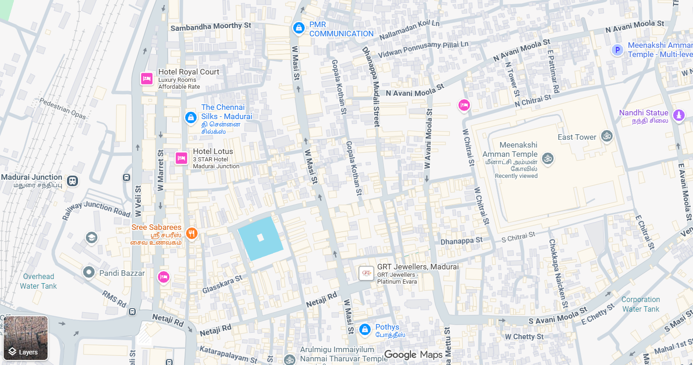
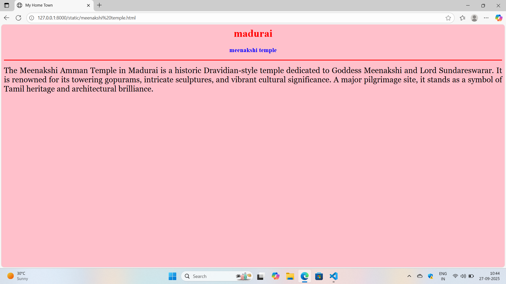
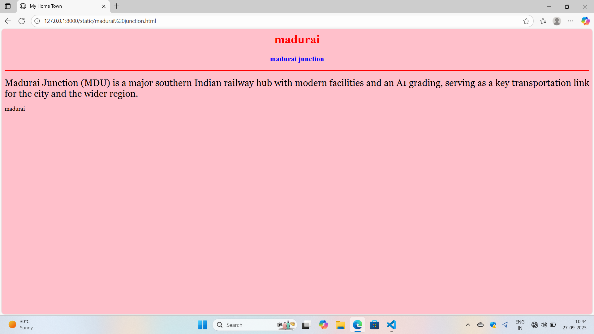
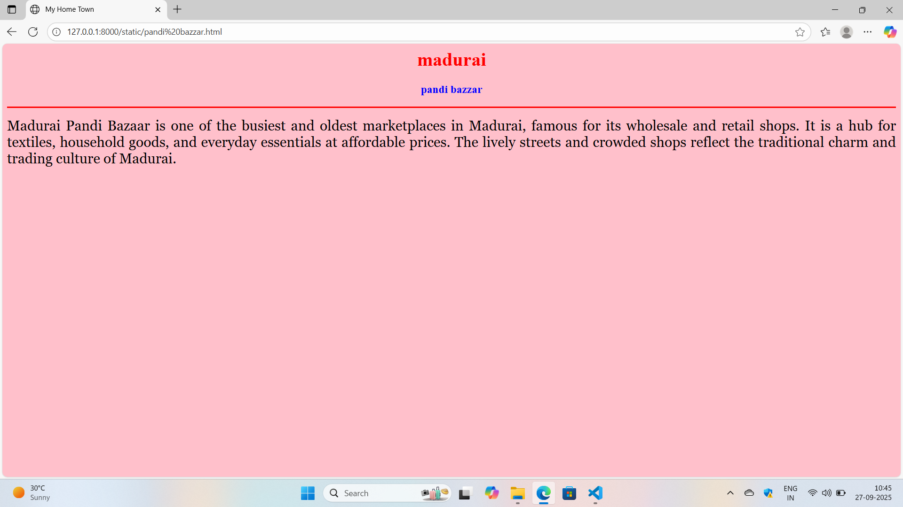
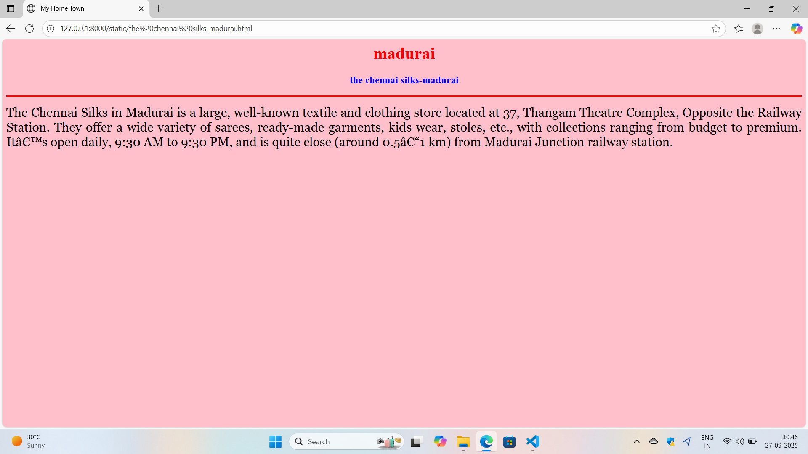

# Ex04 Places Around Me
## Date: 24-09-2025

## AIM
To develop a website to display details about the places around my house.

## DESIGN STEPS

### STEP 1
Create a Django admin interface.

### STEP 2
Download your city map from Google.

### STEP 3
Using ```<map>``` tag name the map.

### STEP 4
Create clickable regions in the image using ```<area>``` tag.

### STEP 5
Write HTML programs for all the regions identified.

### STEP 6
Execute the programs and publish them.

## CODE
```
map.html
<!doctype html>
<head>
<title>My Home Town</title>
</head>
<body>
<h1 align="center">
<font color="red"><b>madurai</b></font>
</h1>
<h3 align="center">
<font color="blue"><b>NIWASH.K (25014908)</b></font>
</h3>
<center>

<map name="madurai">
    <area shape="rect" alt="meenakshi temple" title="meenakshi temple" href="meenakshi temple.html" coords="700,250,850,400">
    <area shape="rect" alt="madurai junction" title="madurai junction" href="madurai junction.html" coords="0,200,100,300">
    <area shape="rect" alt="pandi bazzar" title="pandi bazzar" href="pandi bazzar.html" coords="125,350,250,500">
    <area shape="rect" alt="the chennai silks-madurai" title="the chennai silks-madurai" href="the chennai silks-madurai.html" coords="275,125,400,302">
    <area shape="rect" alt="grt jewellers-madurai" title="grt jewellers-madurai" href="grt jewellers-madurai.html" coords="450,350,600,550">
</map>
<<<<<<< HEAD

</center>

</body>

</html>

grt jewellers-madurai.html
<html>
<head>
<title>My Home Town</title>
</head>
<body bgcolor="pink">
<h1 align="center">
<font color="red"><b>madurai</b></font>
</h1>
<h3 align="center">
<font color="blue"><b>grt jewellers-madurai</b></font>
</h3>
<hr size="3" color="red">
<p align="justify">
<font face="Georgia" size="5">
GRT Jewellers, founded in 1964 in Madurai , is one of India’s most trusted jewellery brands.
They offer gold, diamond, platinum, and silver jewellery, known for purity and craftsmanship.
With 60+ showrooms in India and abroad, GRT blends tradition with modern elegance.
</p>
</body>
</html>
=======
>>>>>>> f03ec29792183bd236c1ba76f6f84f0793406696

</center>

<<<<<<< HEAD
madurai junction.html
<html>
<head>
<title>My Home Town</title>
</head>
<body bgcolor="pink">
<h1 align="center">
<font color="red"><b>madurai</b></font>
</h1>
<h3 align="center">
<font color="blue"><b>grt jewellers-madurai</b></font>
</h3>
<hr size="3" color="red">
<p align="justify">
<font face="Georgia" size="5">
GRT Jewellers, founded in 1964 in Madurai , is one of India’s most trusted jewellery brands.
They offer gold, diamond, platinum, and silver jewellery, known for purity and craftsmanship.
With 60+ showrooms in India and abroad, GRT blends tradition with modern elegance.
</p>
</body>
</html>

meenakshi temple.html
<html>

<head>

<title>My Home Town</title>

</head>

<body bgcolor="pink">

<h1 align="center">

<font color="red"><b>madurai</b></font>

</h1>

<h3 align="center">

<font color="blue"><b>meenakshi temple</b></font>

</h3>

<hr size="3" color="red">

<p align="justify">

<font face="Georgia" size="5">
The Meenakshi Amman Temple in Madurai is a historic Dravidian-style temple dedicated to Goddess Meenakshi and Lord Sundareswarar.
It is renowned for its towering gopurams, intricate sculptures, and vibrant cultural significance.
A major pilgrimage site, it stands as a symbol of Tamil heritage and architectural brilliance.    
</p>

</body>

</html>

pandi bazzar.html
<html>

<head>

<title>My Home Town</title>

</head>

<body bgcolor="pink">

<h1 align="center">

<font color="red"><b>madurai</b></font>

</h1>

<h3 align="center">

<font color="blue"><b>pandi bazzar</b></font>

</h3>

<hr size="3" color="red">

<p align="justify">

<font face="Georgia" size="5">
Madurai Pandi Bazaar is one of the busiest and oldest marketplaces in Madurai, famous for its wholesale and retail shops.
It is a hub for textiles, household goods, and everyday essentials at affordable prices.
The lively streets and crowded shops reflect the traditional charm and trading culture of Madurai.    
</p>

</body>

</html>

the chennai silks-madurai.html
<html>

<head>

<title>My Home Town</title>

</head>

<body bgcolor="pink">

<h1 align="center">

<font color="red"><b>madurai</b></font>

</h1>

<h3 align="center">

<font color="blue"><b>the chennai silks-madurai</b></font>

</h3>

<hr size="3" color="red">

<p align="justify">

<font face="Georgia" size="5">
The Chennai Silks in Madurai is a large, well-known textile and clothing store located at 37, Thangam Theatre Complex, Opposite the Railway Station. 
They offer a wide variety of sarees, ready-made garments, kids wear, stoles, etc., with collections ranging from budget to premium. 
It’s open daily, 9:30 AM to 9:30 PM, and is quite close (around 0.5–1 km) from Madurai Junction railway station.    
</p>

</body>

</html>
```

## OUTPUT

 
 
 
 
 



## RESULT
The program for implementing image maps using HTML is executed successfully.
